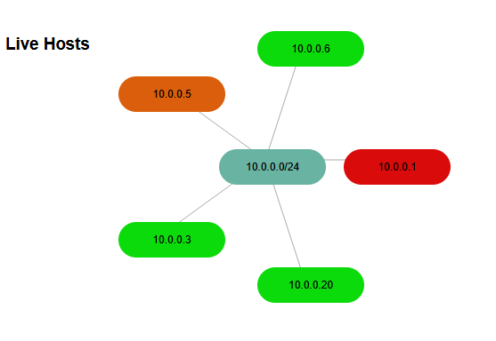

# Network Scanner

As part of my assignment for my mini-project in Networks and Security module, I was tasked with creating a working security solution or system, I decided to create a network scanner.

My project is controlled through an interactive terminal where in which the user inputs their desired host in which they would like to learn more about.


## What it does

- **Host discovery (LAN):** ping-scan a subnet and export discovered live hosts to `live_hosts.json`.
- **Port / service scanning:** run a quick or aggressive scan to enumerate ports + services and attempt OS/device fingerprinting.
- **SMB/LAN enumeration (Windows/SMB targets):** checks 139/445, runs SMB NSE scripts (signing, protocol versions, OS discovery, NetBIOS info).
- **Vulnerability scanning (NSE):** runs Nmap vulnerability scripts and saves per-host reports to `{ip}_vuln_scan.json`.
- **Visual network map:** `index.html` renders the discovered hosts around a central “network” node and colours each host based on its saved risk score.
- **Provides AI feedback:**  Utilises an LLM that reads the vulnerability JSON report and produces a feedback overview of the JSON report with feedback guiding the user in how to improve their security.
---
## Video Showcasing tool in action

[▶️ Click here to watch the demo](img/Mini-Project.mp4)

## Installation

### System
- Python 3.9+ recommended
- Packages:
  - `python-nmap`

Install:
```bash
pip install nmap
pip install ollama 